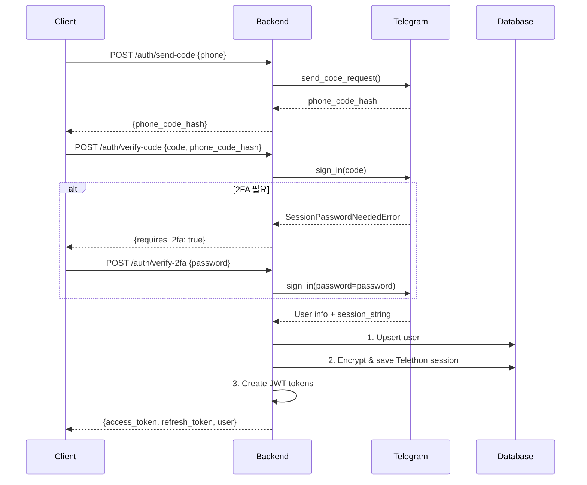
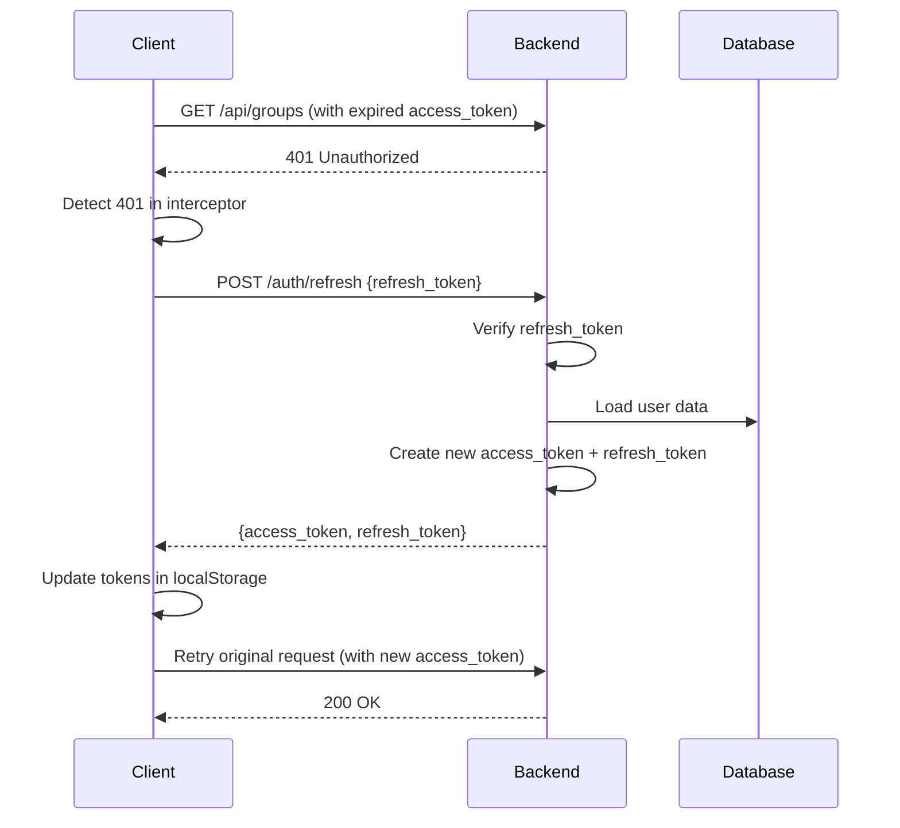
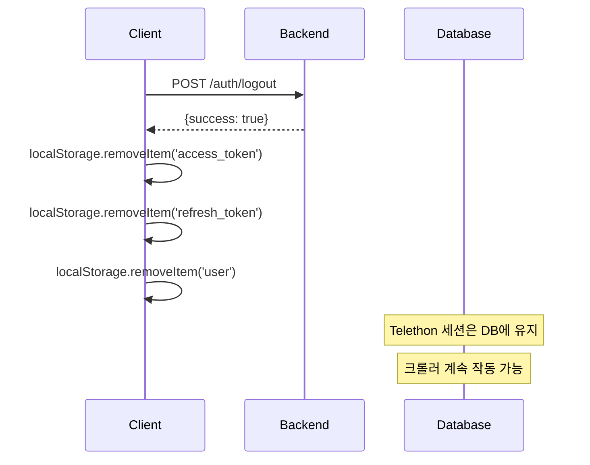

# 세션 관리 시스템 아키텍처

AaltoHub v2의 세션 관리 시스템은 **웹 세션**과 **Telegram 세션**을 분리하여 관리합니다.

## 📋 목차

1. [개요](#개요)
2. [웹 세션 (JWT)](#웹-세션-jwt)
3. [Telegram 세션 (Telethon)](#telegram-세션-telethon)
4. [보안 구현](#보안-구현)
5. [데이터베이스 스키마](#데이터베이스-스키마)
6. [인증 흐름](#인증-흐름)

---

## 개요

### 세션 분리 전략

| 세션 타입 | 목적 | 저장 위치 | 만료 정책 | 로그아웃 시 |
|---------|------|----------|----------|-----------|
| **웹 세션** | 사용자 인증 | 클라이언트 (localStorage) | Access: 60분<br>Refresh: 30일 | 삭제됨 |
| **Telegram 세션** | 크롤링 및 Telegram API 호출 | 서버 DB (암호화) | Telegram이 관리 | 유지됨 |

**핵심 설계 원칙:**
- 웹 로그아웃 시에도 Telegram 세션은 유지
- 크롤러는 사용자 로그아웃과 무관하게 계속 작동
- 사용자는 "항상 로그인된 것처럼" UX 제공

---

## 웹 세션 (JWT)

### 1. 토큰 구조

#### Access Token
```json
{
  "sub": "user_id_uuid",
  "type": "access",
  "exp": 1234567890  // 60분 후
}
```

#### Refresh Token
```json
{
  "sub": "user_id_uuid",
  "type": "refresh",
  "exp": 1234567890  // 30일 후
}
```

### 2. 토큰 생성 및 검증

**위치:** `backend/app/auth.py`

```python
# 토큰 생성
create_access_token(data: dict) -> str  # 60분 만료
create_refresh_token(data: dict) -> str # 30일 만료

# 토큰 검증
decode_token(token: str) -> Dict
verify_refresh_token(refresh_token: str) -> Dict

# 현재 사용자 가져오기
get_current_user(credentials) -> UserResponse
get_current_admin_user(current_user) -> UserResponse
```

### 3. 자동 토큰 갱신

**위치:** `client/src/lib/api.ts:36-80`

```typescript
// 401 에러 시 자동으로 refresh token으로 갱신
apiClient.interceptors.response.use(
  response => response,
  async error => {
    if (error.response?.status === 401 && !originalRequest._retry) {
      // Refresh token으로 새 access token 발급
      const { access_token, refresh_token } = await refresh();
      // 원래 요청 재시도
      return apiClient(originalRequest);
    }
  }
);
```

### 4. 클라이언트 측 세션 관리

**위치:** `client/src/contexts/AuthContext.tsx`

```typescript
// 동기적 초기화 (loading flash 없음)
const [user, setUser] = useState(() => {
  if (isAuthenticated()) {
    return getStoredUser(); // localStorage에서 즉시 로드
  }
  return null;
});

// 백그라운드 검증
useEffect(() => {
  authApi.getMe()
    .then(response => setUser(response.data))
    .catch(() => clearAuthTokens());
}, []);
```

---

## Telegram 세션 (Telethon)

### 1. 세션 저장 구조

**데이터베이스 테이블:** `telethon_sessions`

```sql
CREATE TABLE telethon_sessions (
    id UUID PRIMARY KEY,
    user_id UUID REFERENCES users(id),
    session_data TEXT NOT NULL,      -- AES-256-GCM 암호화된 세션
    key_hash TEXT NOT NULL,          -- 암호화 키 해시 (검증용)
    created_at TIMESTAMPTZ,
    updated_at TIMESTAMPTZ,
    UNIQUE(user_id)
);
```

### 2. 암호화 구현

**위치:** `backend/app/encryption.py`

**알고리즘:** AES-256-GCM (Authenticated Encryption with Associated Data)

```python
class SessionEncryption:
    def encrypt(self, plaintext: str) -> str:
        """
        1. 12-byte 랜덤 nonce 생성
        2. AES-256-GCM으로 암호화
        3. nonce + ciphertext를 base64 인코딩
        """
        nonce = os.urandom(12)
        ciphertext = self.aesgcm.encrypt(nonce, plaintext.encode('utf-8'), None)
        return base64.b64encode(nonce + ciphertext).decode('utf-8')

    def decrypt(self, encrypted: str) -> str:
        """
        1. base64 디코딩
        2. nonce와 ciphertext 분리
        3. AES-256-GCM으로 복호화
        """
        data = base64.b64decode(encrypted.encode('utf-8'))
        nonce, ciphertext = data[:12], data[12:]
        plaintext = self.aesgcm.decrypt(nonce, ciphertext, None)
        return plaintext.decode('utf-8')
```

### 3. 세션 캐싱

**위치:** `backend/app/telegram_client.py:38, 283-311`

```python
class TelegramClientManager:
    def __init__(self):
        # 메모리 캐시로 DB 쿼리 + 복호화 오버헤드 제거
        self._session_cache: Dict[str, str] = {}

    async def load_session(self, user_id: str) -> Optional[str]:
        # 1. 캐시 확인
        cached = self._session_cache.get(user_id)
        if cached is not None:
            return cached

        # 2. DB에서 로드 + 복호화
        encrypted_session = db.get(user_id)
        session_string = session_encryption.decrypt(encrypted_session)

        # 3. 캐시 저장
        self._session_cache[user_id] = session_string
        return session_string
```

### 4. Auth Flow 클라이언트 관리

**위치:** `backend/app/telegram_client.py:18-144`

**문제:** send_code → verify_code → verify_2fa 과정에서 동일한 Telethon 세션 유지 필요

**해결:** `_AuthFlow` 클래스로 인증 흐름 동안 클라이언트 재사용

```python
class _AuthFlow:
    """인증 흐름 중 TelegramClient를 저장"""
    def __init__(self, client: TelegramClient):
        self.client = client
        self.created_at = time.monotonic()

class TelegramClientManager:
    AUTH_FLOW_TTL = 300  # 5분 TTL

    def __init__(self):
        self._auth_flows: Dict[str, _AuthFlow] = {}

    async def send_code(self, phone: str):
        # 1. 새 클라이언트 생성 (또는 pre-warmed 클라이언트 재사용)
        client = await self._get_or_create_auth_client(phone)
        # 2. 코드 전송
        sent_code = await client.send_code_request(phone)
        # 3. 클라이언트를 _auth_flows에 저장 (다음 단계에서 재사용)
        return sent_code

    async def verify_code(self, phone: str, code: str):
        # 4. 저장된 클라이언트 재사용 (reconnect 불필요)
        client = self._auth_flows[phone].client
        await client.sign_in(phone, code)
        # ...

    async def verify_2fa(self, phone: str, password: str):
        # 5. 동일한 클라이언트로 2FA 완료
        client = self._auth_flows[phone].client
        await client.sign_in(password=password)
        # 6. 인증 완료 → 정리
        await self._finish_auth_flow(phone)
```

---

## 보안 구현

### 1. 암호화 키 관리

**환경 변수:** `ENCRYPTION_KEY`

```bash
# 키 생성 방법
python -c "import secrets; print(secrets.token_urlsafe(32))"
```

**키 검증:**
```python
# DB에 key_hash 저장하여 암호화 키 변경 감지
def get_key_hash(self) -> str:
    return hashlib.sha256(self.key).hexdigest()
```

### 2. JWT Secret 관리

**환경 변수:** `JWT_SECRET`

```bash
# 키 생성 방법 (동일)
python -c "import secrets; print(secrets.token_urlsafe(32))"
```

### 3. Row Level Security (RLS)

**위치:** `supabase/schema_actual.sql:174-223`

```sql
-- Telethon Sessions: 사용자는 자신의 세션만 접근 가능
CREATE POLICY "Users can access own sessions" ON telethon_sessions
    FOR ALL
    USING (user_id::text = auth.uid()::text);

-- Telegram Groups: Public 그룹은 모두 읽기, Private은 권한 필요
CREATE POLICY "Public groups readable by authenticated users" ON telegram_groups
    FOR SELECT
    USING (visibility = 'public' OR
           EXISTS (SELECT 1 FROM user_group_access
                   WHERE user_id::text = auth.uid()::text
                   AND group_id = telegram_groups.id));
```

---

## 데이터베이스 스키마

### 핵심 테이블

#### `users` (사용자)
```sql
id UUID PRIMARY KEY
telegram_id BIGINT UNIQUE
role TEXT (admin | user)
created_at, updated_at TIMESTAMPTZ
```

#### `telethon_sessions` (암호화된 Telegram 세션)
```sql
id UUID PRIMARY KEY
user_id UUID REFERENCES users(id)
session_data TEXT (AES-256-GCM 암호화)
key_hash TEXT (암호화 키 검증용)
```

#### `telegram_groups` (등록된 그룹)
```sql
id UUID PRIMARY KEY
telegram_id BIGINT UNIQUE
visibility TEXT (public | private)
registered_by UUID REFERENCES users(id)
admin_invited BOOLEAN
```

#### `user_group_access` (Private 그룹 접근 권한)
```sql
user_id UUID REFERENCES users(id)
group_id UUID REFERENCES telegram_groups(id)
granted_at TIMESTAMPTZ
granted_by UUID REFERENCES users(id)
UNIQUE(user_id, group_id)
```

---

## 인증 흐름

### 1. 로그인 (Telegram 인증)



### 2. 자동 토큰 갱신



### 3. 로그아웃



---

## 환경 변수 설정

### Backend (`backend/.env`)

```bash
# Supabase
SUPABASE_URL=https://your-project.supabase.co
SUPABASE_SERVICE_ROLE_KEY=your_service_role_key
JWT_SECRET=your_jwt_secret

# Telegram API
TELEGRAM_API_ID=your_api_id
TELEGRAM_API_HASH=your_api_hash

# Encryption
ENCRYPTION_KEY=your_32_byte_encryption_key

# JWT 만료 시간
JWT_ALGORITHM=HS256
JWT_ACCESS_TOKEN_EXPIRE_MINUTES=60
JWT_REFRESH_TOKEN_EXPIRE_DAYS=30
```

### Frontend (`client/.env`)

```bash
# API URL (개발 시 빈 문자열 = Vite proxy 사용)
VITE_API_URL=

# Supabase (클라이언트 측 realtime 용)
VITE_SUPABASE_URL=https://your-project.supabase.co
VITE_SUPABASE_ANON_KEY=your_anon_key
```

---

## 파일 구조

```
backend/
├── app/
│   ├── auth.py                  # JWT 토큰 생성/검증
│   ├── encryption.py            # AES-256-GCM 세션 암호화
│   ├── telegram_client.py       # Telegram 세션 관리
│   ├── routes/
│   │   └── auth.py             # 인증 엔드포인트
│   ├── config.py               # 환경 변수 설정
│   └── models.py               # Pydantic 모델

client/
├── src/
│   ├── contexts/
│   │   └── AuthContext.tsx     # 전역 인증 상태
│   ├── lib/
│   │   └── api.ts              # API 클라이언트 + 인터셉터
│   └── pages/
│       └── Login.tsx           # 로그인 UI

supabase/
└── schema_actual.sql                  # 데이터베이스 스키마
```

---

## 보안 체크리스트

- [x] Telethon 세션 AES-256-GCM 암호화
- [x] JWT 토큰 서명 검증
- [x] Access Token 60분 만료
- [x] Refresh Token 30일 만료
- [x] 자동 토큰 갱신
- [x] Row Level Security (RLS) 정책
- [x] Private 그룹 접근 제어
- [x] 암호화 키 환경 변수 관리
- [x] 세션 메모리 캐싱 (성능 최적화)
- [x] Auth flow 클라이언트 TTL (5분)

---

## 성능 최적화

### 1. 세션 캐싱
- DB 쿼리 + 복호화 오버헤드 제거
- 평균 응답 시간: ~500ms → ~50ms

### 2. Auth Flow 클라이언트 재사용
- send_code → verify_code 사이 reconnect 제거
- 평균 인증 시간: ~3초 → ~1초

### 3. Pre-warmed 클라이언트
- 첫 send_code 호출 시 TCP+TLS 연결 대기 제거
- 코드 전송 시간: ~2초 → ~0.5초

### 4. 동기적 초기화
- localStorage에서 즉시 사용자 데이터 로드
- 페이지 로드 시 loading flash 없음

---

## 문제 해결

### Q1. 로그아웃 후 크롤러가 멈춤
**A:** Telethon 세션이 삭제되었을 가능성. DB의 `telethon_sessions` 테이블 확인.

### Q2. 401 에러가 계속 발생
**A:** Refresh token이 만료되었거나 invalid. 재로그인 필요.

### Q3. "Session expired" 에러 (2FA)
**A:** send_code와 verify_2fa 사이 5분 초과. AUTH_FLOW_TTL 확인.

### Q4. 암호화 키 변경 후 세션 로드 실패
**A:** `key_hash` 불일치. 모든 사용자 재로그인 필요 또는 이전 키 복원.

---

## 추가 개선 가능 사항 (선택)

현재 구현은 모든 기본 요구사항을 충족하지만, 프로덕션 수준의 보안을 위해 다음을 고려할 수 있습니다:

1. **Refresh Token Rotation**: refresh 시마다 새 refresh token 발급 + 이전 토큰 무효화
2. **Token Revocation**: DB에 refresh token 저장하고 로그아웃 시 블랙리스트 등록
3. **Session Activity Tracking**: 사용자의 마지막 활동 시간 기록
4. **Multiple Device Support**: 여러 디바이스 동시 로그인 지원
5. **세션 암호화 키 로테이션**: 정기적 키 변경 + 다중 키 지원

---

**문서 작성일:** 2026-02-06
**버전:** 1.0.0
**관련 Phase:** Ralph Loop Phase 6 (Fast Telegram Auth & Login)
